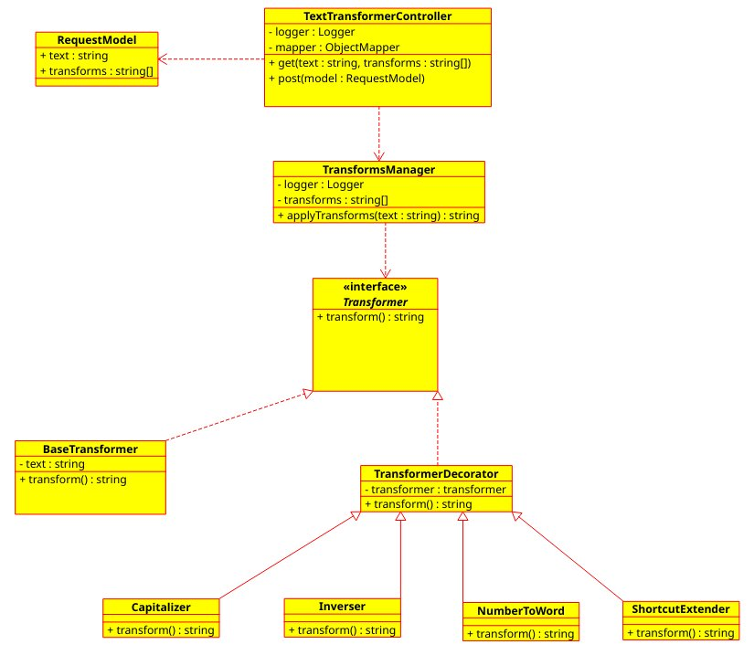

# lazurowe-fale (aka TextTransformer)
  
IO project  
Team:  
Proxy product owner: 132314 - nanadarne  
Scrum master: 132212 - Johny9700  
Developer: 116753 - Taro94  
Developer: 132312 - invalidcorgi  

### UML
  

### Testy wydajnościowe:  
  
Test polegał na wysłaniu do API 10000 zapytań z tekstem o długości 110 znaków i zleceniem 3 transformacji.
Przez większość czasu API odpowiadało na zapytania szybciej niż JMeter był w stanie je generować.
W momentach gdy API się zapychało czas odpowiedzi nie przekraczał 2 sekund.

### JavaDoc
Javadoc w formie strony internetowej jest spakowany w .
Znajduje się w Project Reports -> JavaDocs.

### Pomiar jakości kodu  
Celem było pokrycie testami minimum 15% linii kodu pakietu pl.put.poznan.transformer.logic.
Pomiar został dokodany przez narzędzie Cobertura.
Wyniki pomiaru można znaleźć w formie strony internetowej spakowanej do .
Wyniki znajdują się w Project Reports -> Cobertura Test Coverage.

### GUI dla aplikacji  
Z API można korzystać przy pomocy strony internetowej.
Można ją uruchomić po przejściu do katalogu src/website i wykonaniu polecenia python3 main.py.
Do pomyślnego wykonania polecenia wymagana jest instalacja pakietu pythona flask.
